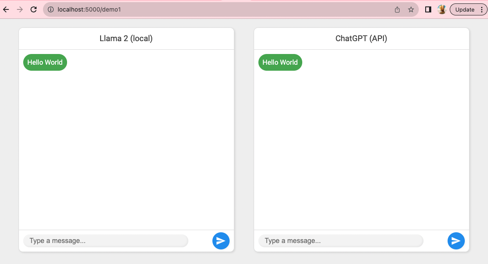

This is a small kitchen sink app I build to learn langchain

This assumes you are running local Llama (see https://github.com/jmorganca/ollama) and have a working ChatGPT API key

To run this app

```
flask --app app.py run --debug
```

Load the url `http://localhost:5000/demo1` to see the first demo


